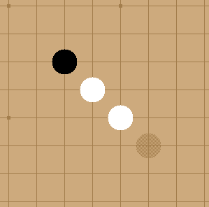
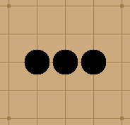
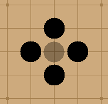

# Gomoku AI


## 🎮 Overview

This project is a full implementation of the game of **Gomoku** with an AI opponent powered by the **Minimax algorithm**.

## 📋 Rules implemented

**Win Conditions:**
- Align five (or more) consecutive stones that can not be captured
- OR capture 10 enemy stones

**Captures:** Flank two opponent stones to remove them.

**Forbidden Move:** Creating two simultaneous free-threes (double-three).

---

### Captures

Captures occur when you place two of your stones at both ends of exactly two of your opponent’s stones (neither one stone nor more than two stones). The captured stones are removed from the board, freeing those positions for reuse.


**Example:**

White stones can capture the black stones by placing a stone


### Double Free Three
A "free three" is a line of three stones that can lead to a "free four", a move that cannot be defended because either endpoint of the line creates a winning row of five stones. To balance gameplay, moves that create two simultaneous free threes (a "double free three") are forbidden.

✅ Free Three:




❌ Double Three:



It is forbidden to place a black stone in the middle as it would introduce two double three.

---

## ✨ Features

- **AI Opponent:** Play against a strong Minimax-based AI.
- **Hotseat Mode:** Two human players on the same computer.
- **Move Suggestions:** Get AI hints in PvP mode.
- **Board size:** 19x19, 15x15 or 13x13 
- **Performance Timer:** Shows AI move calculation time.
- **Alternative starting:** conditions (Standard, Pro, Swap)

---

## 🚀 Installation & Run (linux)

Clone the repository and build the project:

```bash
git clone https://github.com/lanzaj/gomoku.git
make
```

---

## 🧠 How It Works

The AI uses Minimax with alpha-beta pruning and a custom heuristic:

- Searches up to 10 levels deep
- Evaluates board states for:
  - Alignment potential (open threes, flanked threes, open fours...)
  - Capture opportunities
  - Already captured stones
  - Figures
  - Broken alignments

## 🛠️ Development

- **Language:** C++, python
- **UI Framework:** tkinter
- **Unit Tests:** GoogleTest (run with `cd backend && make test`)


## Credits

- User interface designed by [Grégoire Gobert](https://github.com/gregoiregobert)
