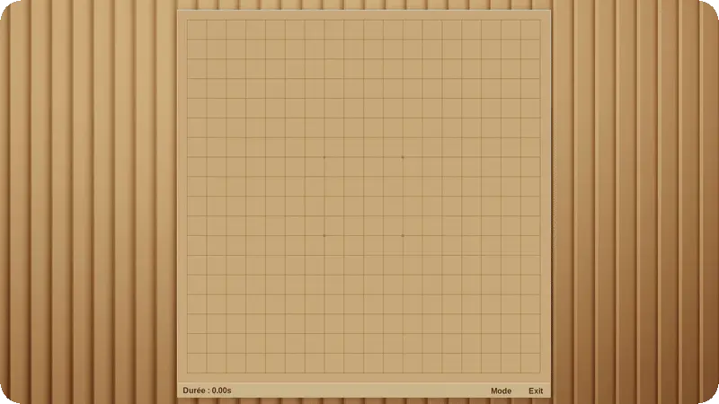

# Gomoku AI



## 🎮 Overview

This project is a full implementation of **Gomoku** with an AI opponent powered by the **Minimax algorithm** and a custom heuristic evaluation.

**Rules implemented:**
- **19x19, 15x15 or 13x13 board size**
- **Five or more in a row** wins
- **Captures** (Ninuki/Pente variant)
- **Endgame capture rules**
- **No double-threes**

The AI adapts to the opponent’s strategy and responds in under half a second per move in average.

---

## ✨ Features

- **AI Opponent:** Play against a strong Minimax-based AI.
- **Hotseat Mode:** Two human players on the same computer.
- **Move Suggestions:** Get AI hints in PvP mode.
- **Capture Mechanics:** Flank pairs of opponent stones to remove them.
- **Rule Enforcement:** Automatic handling of captures, double-threes, and win conditions.
- **Performance Timer:** Shows AI move calculation time.
- **Alternative starting:** conditions (Standard, Pro, Swap)

---

## 🚀 Installation & Run

Clone the repository and build the project:

```bash
git clone https://github.com/lanzaj/gomoku.git
make
```

---

## 🧠 How It Works

The AI uses Minimax with alpha-beta pruning and a custom heuristic:

- Searches up to 10 levels deep
- Evaluates board states for:
  - Alignment potential (open threes, open fours, threats)
  - Capture opportunities
---

## 📜 Rules Recap

**Win Conditions:**
- Align five (or more) consecutive stones
- OR capture 10 enemy stones

**Forbidden Move:** Creating two simultaneous free-threes (double-three).

**Captures:** Flank two opponent stones to remove them.

---

## 🛠️ Development

- **Language:** C++, python
- **UI Framework:** tkinter
- **Build Tool:** Makefile (`make`, `make clean`)
- **Unit Tests:** GoogleTest (run with `cd backend && make test`)
